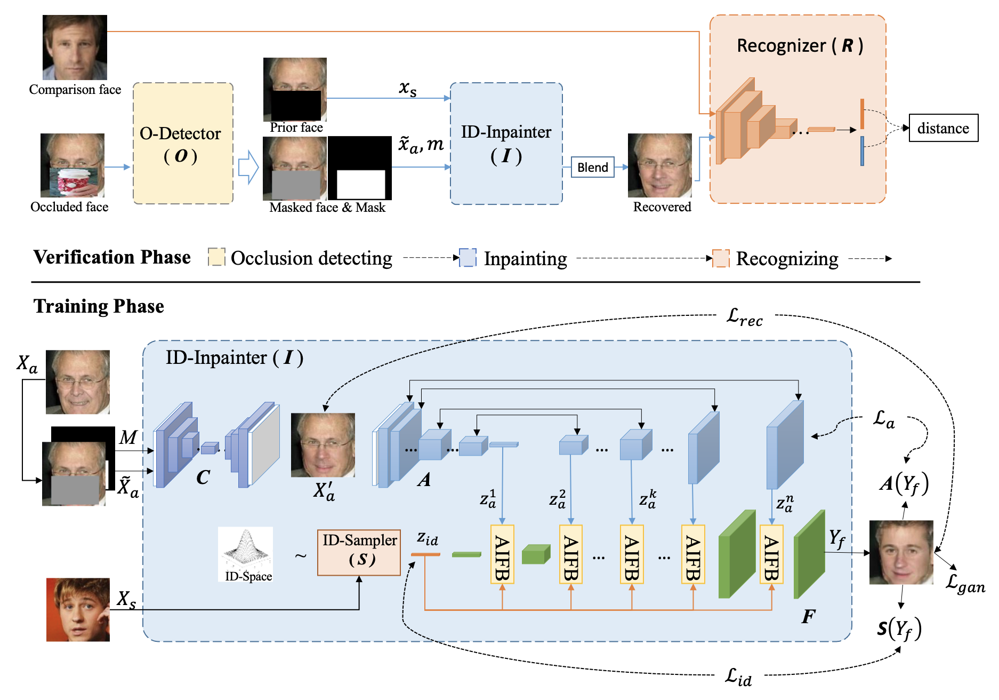
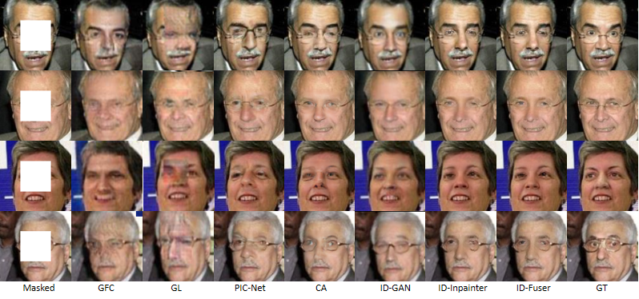
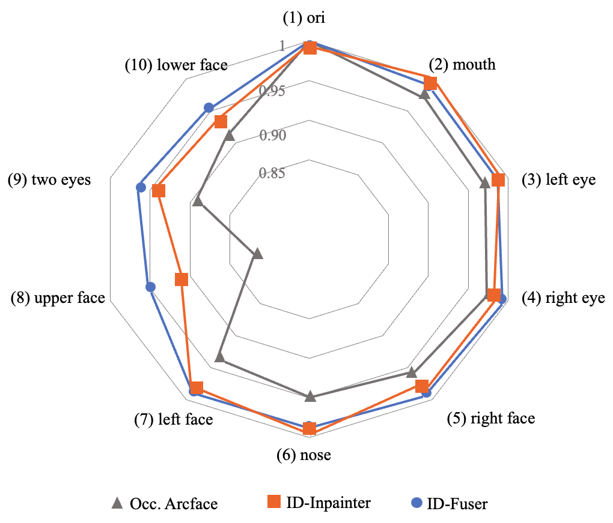

# Recovery-based Occluded Face Recognition by Identity-guided Inpainting &mdash; Official PyTorch Implementation


![examples]
(./output/result/result1.png) 
(./output/result/result2.png)  


Official Implementation of [Recovery-based Occluded Face Recognition by Identity-guided Inpainting] with [Pytorch-Lightning](https://github.com/PyTorchLightning/pytorch-lightning).
In the paper,we propose \textbf{ID-Inpainter}, an identity-guided face inpainting model, which preserves the identity information to the greatest extent through a more accurate identity sampling strategy and a GAN-like fusing network.

## Datasets

### Preparing Data

You need to download and unzip:
- FFHQ-112 ([Download link](https://drive.google.com/file/d/1yZnKnUeWhrvP25_t0pDget2Dac5cT8zA/view?usp=sharing))
- CelebA-112 ([Download link](https://drive.google.com/file/d/1nb_tn8JJLGUJ32YKCb6W7jVmyRA_N9nq/view?usp=sharing))
- VGGFace-112 ([Download link](https://drive.google.com/file/d/10AKN3SpHZDD46IzE-lOmb6M26MOzP2E4/view?usp=sharing))
- LFW-112 ([Download link](https://drive.google.com/file/d/1PhdOuU5FtiJEUZjqwR-2sbtbyIOYc_mk/view?usp=sharing))
- CFP-FP-112 ([Download link](https://drive.google.com/file/d/1uv-_n0VpZkR000yynqkdA3vn9ipy_pmO/view?usp=sharing))
- AgeDB-30 ([Download link](https://drive.google.com/file/d/1PugDuk0fTjeSzNNqx7mW5hb7Xd3cS-TI/view?usp=sharing))
- Facecrub-tsne([Download link](https://drive.google.com/file/d/1CS_uvmaMA8uRdsuZj4ehQ6CeBwSULXG2/view?usp=sharing))
- occluders.zip([Download link](data.occluders.tar.gz))
### Data preprocessing
Preprocessing code is mainly based on retinaFace.
Please processing FFHQ,CelebA,VGGFace by running:
```bash
python preprocess112.py --root ./data/CelebA/raw/ --output_dir ./data/CelebA/celeba112/
python preprocess112.py --root ./data/FFHQ/raw/ --output_dir ./data/FFHQ/celeba112/
python preprocess112.py --root ./data/VGGFace/raw/ --output_dir ./data/VGGFace/celeba112/
```
processing FLW by running:
```bash

python preprocess112.py --root ./data/LFWs/raw/ --output_dir ./data/LFWs/lfw_112/ --has_subdirs

```
You may modify our [preprocess](./preprocess112x112.py) with multi-processing functions to finish pre-processing step much faster.

## Training

### Configuration
There is `yaml` file in the [`config`](./config) folder.
They **must** be edited to match your training requirements (dataset, metadata, etc.).

- [`config/train.yaml`](./config/train.yaml): Configs for training Fusor-Net.
  - Fill in the blanks of: `dataset_dir`, `valset_dir`
  - You may want to change: `batch_size` for GPUs other than 32GB V100, or `chkpt_dir` to save checkpoints in other disk.

  
### Training Fusor_Net：
```bash
#step1：set id_weight = 5 in loss.py, set dataset_dir and valset_dir in train.yaml, running:
python fusor_trainer.py -n ffhq -e 3 

#step2：set id_weight = 7 in loss.py,set dataset_dir and valset_dir in train.yaml,running:
python fusor_trainer.py -n celeba -e 6 -p './chkpt/ffhq/ffhq_last_2.ckpt'

#step3：set id_weight = 9 in loss.py,set dataset_dir and valset_dir in train.yaml,running:
python fusor_trainer.py -n vgg -e 10 -p './chkpt/celeba/celeba_last_5.ckpt'
```
### Pre-trained models
- retina_model ([Download link](https://drive.google.com/file/d/1jZLWGx-9djWuuOh_P93Lp3Lra6DCzHTT/view?usp=sharing))
- Sampler_model ([Download link](https://drive.google.com/file/d/1fQMw6KIB_QyyJclnYRU5NbLP8nwHD09F/view?usp=sharing) )
- CA_model([Download link](https://drive.google.com/file/d/1uDCxAk050fN9oblPft2a0etvRquGOVfi/view?usp=sharing))
- Fusor_model([Download link](https://drive.google.com/file/d/1qMiFPqVLTb5MKZnBu0aUvEPTnQtljkhP/view?usp=sharing))
- Arcface_model([Download link](https://drive.google.com/file/d/1urJwBS3CunxLfwAzfhyupDDJ5LmGUR6z/view?usp=sharing))

During the training process, pre-trained models are offered. you can download and put into locations according to train.yaml.

### Monitoring via Tensorboard

The progress of training with loss values and validation output can be monitored with Tensorboard.
By default, the logs will be stored at `log`, which can be modified by editing `log.log_dir` parameter at config yaml file.

```bash
tensorboard --log_dir log --bind_all # Scalars, Images, Hparams, Projector will be shown.
```

## Inpainting

To inpainting a simgle face, run this command:
```bash

python inpainting.py --checkpoint_path chkpt/vgg220531_last_10.ckpt --image_path output/example/example1.png --mask_path output/example/mask1.png --output_path output/result/result1.png

```

## Recognizing

Please refer to `./prepare_inpainted_datasets.py` for the inpainted datasets generation.

```bash
# build random-part inpainted results of flw_112

python prepare_inpainted_datasets.py --root data/LFWs/20220712/ --unocc_dir data/LFWs/lfw_112/ -m random_part -f ca_id_fill

```

To evaluate the recognization proformance, run this command:
```bash
python lfw_arc_test.py
```
You may modify the paths [config.DATASET.LFW_PATH, config.DATASET.LFW_OCC_PATH, config.DATASET.LFW_PAIRS](./lfw_arc_test.py) with the pair of datasets you want to evaluate.


To plot the ROC curve to visualize the performance improvements, call the function plot() instead of main() in this command:
```bash
python lfw_arc_test.py
```

To compare the intervals between the average similarity of identical and crossed identity pairs, run this command:
```bash
# Note to change the paths of your expected datasets first
python lfw_arc_res50_similarity_gap.py
```

## Results
### Comparison with results from original paper
#### Figure in the original paper

#### Our Results


## License

## Implementation Author

Honglei Li, Yifan Zhang @ MINDs Lab, Inc. (l_honglei@foxmail.com)

## Paper Information

```bibtex

```
